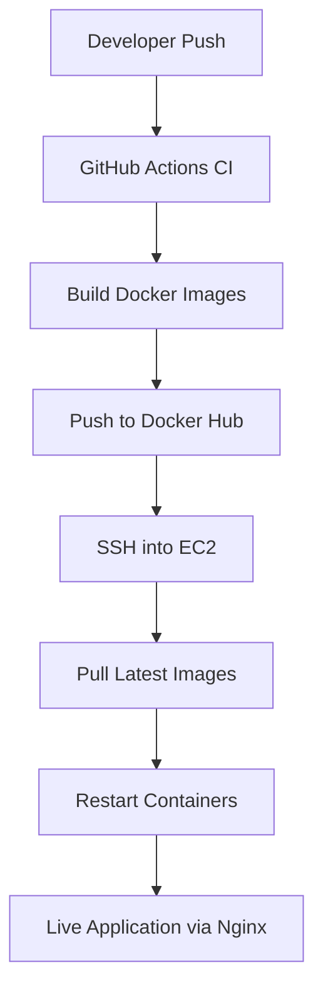

<div align="center">

# 🚀 DevOps Full-Stack Deployment Project

### Production-Ready CI/CD Pipeline with Docker, AWS & GitHub Actions

[](https://www.docker.com/)
[](https://aws.amazon.com/)
[](https://github.com/features/actions)
[](https://www.mongodb.com/)
[](https://www.nginx.com/)

</div>

---

## 📌 Project Overview

This project demonstrates a **production-style DevOps workflow** for deploying a full-stack web application with complete automation. It showcases modern DevOps practices including containerization, CI/CD pipelines, cloud deployment, and infrastructure management.

### 🎯 Key Technologies

| Layer | Technology |
|-------|-----------|
| **Frontend** | React + Vite + TypeScript + TailwindCSS |
| **Backend** | Node.js + Express |
| **Database** | MongoDB Atlas |
| **Containerization** | Docker |
| **Reverse Proxy** | Nginx |
| **Cloud** | AWS EC2 |
| **CI/CD** | GitHub Actions |
| **Image Registry** | Docker Hub |

---

## 🏗 Architecture Overview



### Deployment Flow

```
┌─────────────────┐
│  Developer Push │
└────────┬────────┘
         │
         ▼
┌─────────────────┐
│ GitHub Actions  │
│   Trigger CI    │
└────────┬────────┘
         │
         ▼
┌─────────────────┐
│ Build & Push    │
│ Docker Images   │
└────────┬────────┘
         │
         ▼
┌─────────────────┐
│   Deploy to     │
│    AWS EC2      │
└────────┬────────┘
         │
         ▼
┌─────────────────┐
│ Live Application│
└─────────────────┘
```

---

## 🐳 Docker Setup

The application is fully containerized with three main services:

- **Backend Service** - Node.js/Express API
- **Frontend Service** - React application
- **Nginx Reverse Proxy** - Routes traffic and serves static files

All services run in isolated containers within a shared Docker network, ensuring:
- ✅ Consistency across environments
- ✅ Easy scalability
- ✅ Simplified deployment
- ✅ Resource isolation

---

## ☁️ AWS Deployment

### Infrastructure Setup

- **EC2 Instance** - Ubuntu server hosting the application
- **Security Groups** - Configured for SSH (22) and HTTP (80)
- **Elastic IP** - Static public IP address
- **Docker & Docker Compose** - Installed and configured
- **Automated Deployment** - Via GitHub Actions

---

## 🔁 CI/CD Pipeline

### GitHub Actions Workflow

The automated pipeline performs the following steps:

1. **Build** - Creates Docker images for frontend and backend
2. **Test** - Runs automated tests (optional)
3. **Push** - Uploads images to Docker Hub
4. **Deploy** - SSHs into EC2 and pulls latest images
5. **Restart** - Restarts containers with zero downtime

**Trigger**: Automatic deployment on every push to `main` branch

```yaml
# Simplified workflow visualization
name: Deploy to AWS EC2
on:
  push:
    branches: [main]

jobs:
  deploy:
    - Build Docker images
    - Push to Docker Hub
    - SSH to EC2
    - Pull and restart containers
```

---

## 📁 Project Structure

```
.
├── backend/
│   ├── Dockerfile
│   ├── package.json
│   ├── src/
│   └── ...
├── frontend/
│   ├── Dockerfile
│   ├── package.json
│   ├── src/
│   └── ...
├── nginx/
│   └── nginx.conf
├── docker-compose.yml
├── .github/
│   └── workflows/
│       └── deploy.yml
└── README.md
```

---

## 🌐 Nginx Reverse Proxy Configuration

Nginx is configured to:

- ✅ Serve the frontend React application
- ✅ Proxy `/api` requests to the backend service
- ✅ Handle SSL termination (if configured)
- ✅ Load balancing capabilities
- ✅ Expose application on port 80

```nginx
# Example configuration
server {
    listen 80;
    
    location / {
        proxy_pass http://frontend:3000;
    }
    
    location /api {
        proxy_pass http://backend:5000;
    }
}
```

---

## 🔐 Security Practices

| Security Measure | Implementation |
|-----------------|----------------|
| **Secrets Management** | Environment variables & GitHub Secrets |
| **Database Credentials** | Stored securely, never in code |
| **SSH Keys** | Private key in GitHub Secrets |
| **Docker Hub Auth** | Credentials in GitHub Secrets |
| **No Hardcoded Secrets** | All sensitive data externalized |

---

## 🚀 Deployment Instructions

### One-Command Deployment

Simply push to the main branch:

```bash
git add .
git commit -m "Your commit message"
git push origin main
```

**That's it!** GitHub Actions handles the rest automatically:
- 🔨 Builds images
- 📤 Pushes to Docker Hub
- 🚀 Deploys to EC2
- ♻️ Restarts containers

### Manual Deployment (Optional)

```bash
# SSH into EC2
ssh -i your-key.pem ubuntu@your-ec2-ip

# Pull latest images
docker-compose pull

# Restart services
docker-compose up -d
```

---

## 📊 DevOps Concepts Implemented

✅ **Containerization** - Docker for consistent environments  
✅ **Reverse Proxy** - Nginx for traffic management  
✅ **Infrastructure Networking** - VPC and security groups  
✅ **Elastic IP Management** - Static IP for production  
✅ **CI/CD Automation** - GitHub Actions pipeline  
✅ **Image Registry Workflow** - Docker Hub integration  
✅ **Production Separation** - Build vs Runtime environments  
✅ **Zero-Downtime Deployment** - Rolling updates  

---

## 📈 Future Improvements

- [ ] **HTTPS/SSL** - Let's Encrypt integration
- [ ] **Infrastructure as Code** - Terraform for AWS resources
- [ ] **Monitoring** - Prometheus & Grafana dashboards
- [ ] **Logging** - ELK Stack or CloudWatch
- [ ] **Blue/Green Deployment** - Zero-downtime strategy
- [ ] **Image Versioning** - Semantic versioning & rollback
- [ ] **Auto-scaling** - AWS Auto Scaling Groups
- [ ] **Database Backups** - Automated backup strategy
- [ ] **Load Balancing** - AWS Application Load Balancer
- [ ] **CDN Integration** - CloudFront for static assets

---

## 🛠 Prerequisites

To replicate this project, you'll need:

- AWS Account with EC2 access
- Docker Hub account
- GitHub account
- Basic understanding of:
  - Docker & Docker Compose
  - Linux/Ubuntu
  - Git & GitHub
  - Node.js & React

---

## 📖 Getting Started

### Local Development

```bash
# Clone the repository
git clone <your-repo-url>
cd <project-folder>

# Start with Docker Compose
docker-compose up --build

# Access the application
# Frontend: http://localhost:80
# Backend API: http://localhost:80/api
```

### Environment Variables

Create a `.env` file with:

```env
MONGODB_URI=your_mongodb_connection_string
PORT=5000
NODE_ENV=production
```

---

## 👨‍💻 Author

**Aayush Shah**  
Backend Developer → DevOps Engineer

- 💼 1.6+ years experience in Node.js
---

## 🌟 Key Takeaways

This project demonstrates:

1. **End-to-End DevOps Implementation** - From development to production
2. **Modern Tooling** - Industry-standard technologies
3. **Automation First** - CI/CD for rapid, reliable deployments
4. **Production Best Practices** - Security, scalability, and maintainability
5. **Cloud-Native Architecture** - Containerized microservices on AWS

---

## 📝 License

This project is open source and available under the [MIT License](LICENSE).

---

## 🤝 Contributing

Contributions, issues, and feature requests are welcome!

1. Fork the project
2. Create your feature branch (`git checkout -b feature/AmazingFeature`)
3. Commit your changes (`git commit -m 'Add some AmazingFeature'`)
4. Push to the branch (`git push origin feature/AmazingFeature`)
5. Open a Pull Request

---

## ⭐ Show Your Support

If this project helped you learn DevOps concepts, please give it a ⭐️!

---

<div align="center">

### Made with ❤️ by Aayush Shah

**Happy DevOps-ing! 🚀**

</div>